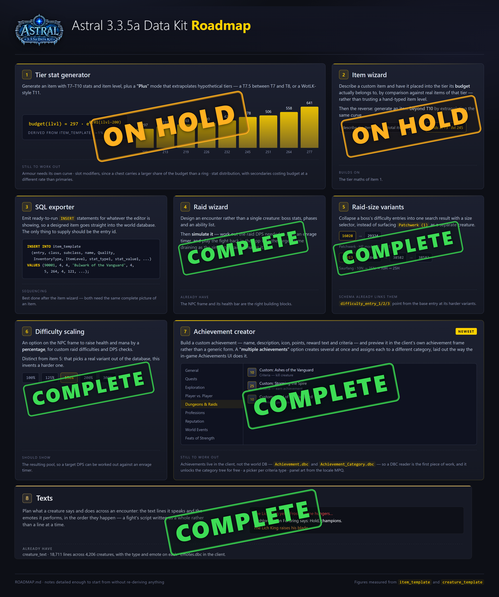

# Astral — a 3.3.5a Data Kit

Astral makes pictures of Wrath of the Lich King things.

Build an **item tooltip**, a **spell tooltip**, an **NPC target frame**, an **achievement card** or
a **chat script**, and it draws the way the game draws — using the icons, fonts and border art from
your own 3.3.5a client — then exports a PNG. Point it at a world database as well and it reads your
server's real items, creatures and loot tables, so a custom piece can start from the one it will
sit beside.



## Getting it

Download the [latest release](https://github.com/Voxstrasza/Astral-Data-Kit/releases), unzip it
anywhere and run `Astral.exe`. No installer, no runtime to fetch.

From source, with Node 18 or newer:

```
npm install
npm run app        # desktop window
npm run serve      # or a browser at http://localhost:4173
npm run package    # build dist\Astral-win32-x64\Astral.exe
```

## First run

Open **Settings** and point at your 3.3.5a folder — the one containing `Data\`. That turns on the
real icons and fonts, the client's spell and achievement tables, and the dungeon browser.

Connecting a **world database** (AzerothCore or TrinityCore schema) in the same dialog is optional.
It adds creature search, item search, real loot tables and real health pools.

## The windows

- **Item** — quality, binding, slot, damage with calculated DPS, stats, sockets, set bonuses and
  green `Equip:`/`Use:` lines. Search your database, or browse loot boss by boss and difficulty by
  difficulty.
- **Spell** — pull a real spell out of the client's `Spell.dbc` and edit it, with its aura drawn as
  a second tooltip.
- **NPC** — the target frame with real health pools, a dungeon and raid browser built from the
  client's own tables, custom difficulty scaling, and portraits captured from the 3D model.
- **Achievement** — the achievement card in the client's own parchment.
- **Texts** — what a creature says, in the colours the chat frame prints them in.

Every window exports a PNG at 1x–4x, copies to the clipboard, and carries a permalink that reopens
the exact state still editable.

## Roadmap

[ROADMAP.md](ROADMAP.md) is the working notebook — what is built, what is parked and why, and the
figures behind each idea, including the WotLK item budget derived from the client's own tables.

## Notes

- Permalinks encode the editor state in the URL fragment and never touch a server.
- The world-database password stays in the local settings file.
- Interface font is [Figtree](https://github.com/erikdkennedy/figtree) (SIL Open Font License).
- Fan-made tool, not affiliated with Blizzard Entertainment. World of Warcraft and its assets are
  the property of Blizzard Entertainment.
