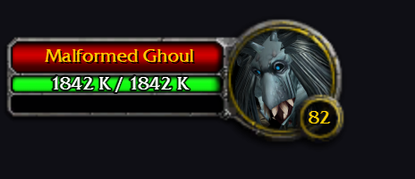
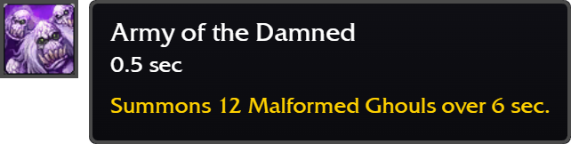
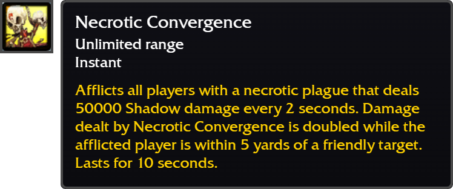
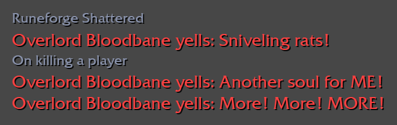
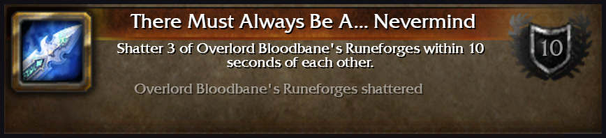
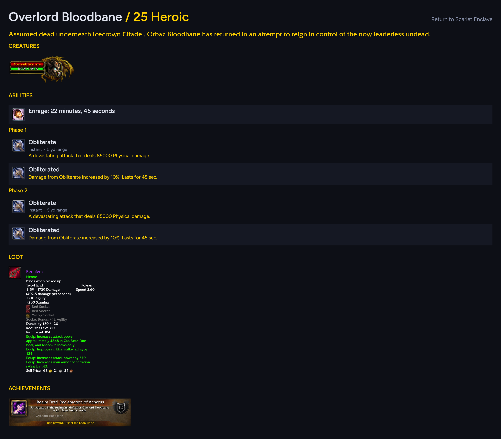

# Astral - Data Kit

Astral is a conceptualization tool for Wrath of the Lich King content.

Design something before it exists in the game. Items, spells, a boss, an achievement, lines of
dialogue. Put it all together and receive a wiki style export in PNG format. Everything you create
is shown as it would be in-game, utilizing icons, fonts, and border art from your 3.3.5a client.
Connect your AzerothCore or TrinityCore database and it will read items, creatures and loot tables,
so a custom piece can be built from it.

Visualize your creativity and see how it would appear in-game.

## Initialization

Open **Settings** and point Astral to your 3.3.5a `/Data` folder. Indexing takes a few moments
for first-time setup and is cached afterwards. Icons, fonts, spell, achievement and dungeon
browser data are all pulled from the client.

Connecting an **AzerothCore** or **TrinityCore** world database is optional, however it adds
finders: creature search, item search, drop lists from bosses, health and mana pools from the
dungeon & raid browser.

## Tools

- **Item** - create an item tooltip, or pull existing data from the database and load it, matching
  the in-game engine.
- **Spell** - create a spell tooltip, or pull existing data from `Spell.dbc` and load it, matching
  the in-game engine.
- **NPC** - in-game target frame with health pools. Create a creature or pull a dungeon/raid
  creature from the database. Customize the scaling and pull portraits from the 3D model, matching
  the in-game engine.
- **Achievement** - create an achievement or load an existing one as it would appear in-game.
- **Texts** - want to formulate some roleplay? Draft some text as it would appear in-game, complete
  with boss whispers and boss announcements.
- **Raid Wizard** - where everything you build with the previous tools can go. Exports an image
  where on one sheet you can view target frames, spells, texts and more.
- **Armory** - build a character and simulate stats with your created gear
  using the in-game stat formulas.

Small exports can be copied to the clipboard, bigger ones can be downloaded. Exports are PNG
format at 1x-4x.

## Examples

Example of target frames:



Example of spell tooltips:





Example of text editor:



Example of achievement editor:



Example of raid wizard output:



## Future features

- **Item wizard** - build upon the gear formula and create gear beyond Icecrown Citadel, or create
  new gearsets that fit nicely in existing tiers.
- **SQL exporter** - export the items you create straight into AzerothCore or TrinityCore:
  ready-to-run `INSERT` statements for whatever the editor is showing, with only an entry id to
  supply.
- **Live portraits** - portraits rendered from the client's own `.m2` models with the camera stored
  inside the model file, so the framing is the game's rather than an approximation. The data half
  is built and verified; a local renderer is the work left.
- **Quest Wizard** - build a series of quests, with in-progress and completion dialog, from any NPC
  you choose and any rewards you choose, using the in-game assets.

## Getting it

Download the [latest release](https://github.com/Voxstrasza/Astral-Data-Kit/releases), unzip it
anywhere and run `Astral.exe`. No installer, no runtime to fetch.

From source, with Node 18 or newer:

```
npm install
npm run app        # the app, from source
npm run package    # build dist\Astral-win32-x64\Astral.exe
```

## Notes

- The world-database password stays in the local settings file.
- Interface font is [Figtree](https://github.com/erikdkennedy/figtree) (SIL Open Font License).
- Fan-made tool, not affiliated with Blizzard Entertainment. World of Warcraft and its assets are
  the property of Blizzard Entertainment.
